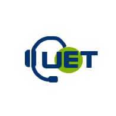

<!-- Improved compatibility of back to top link: See: https://github.com/othneildrew/Best-README-Template/pull/73 -->
<a name="readme-top"></a>
<!--
*** Thanks for checking out the Best-README-Template. If you have a suggestion
*** that would make this better, please fork the repo and create a pull request
*** or simply open an issue with the tag "enhancement".
*** Don't forget to give the project a star!
*** Thanks again! Now go create something AMAZING! :D
-->


<!-- PROJECT SHIELDS -->
<!--
*** I'm using markdown "reference style" links for readability.
*** Reference links are enclosed in brackets [ ] instead of parentheses ( ).
*** See the bottom of this document for the declaration of the reference variables
*** for contributors-url, forks-url, etc. This is an optional, concise syntax you may use.
*** https://www.markdownguide.org/basic-syntax/#reference-style-links
-->
[![Contributors][contributors-shield]][contributors-url]
[![Forks][forks-shield]][forks-url]
[![Stargazers][stars-shield]][stars-url]
[![Issues][issues-shield]][issues-url]
[![MIT License][license-shield]][license-url]
[![LinkedIn][linkedin-shield]][linkedin-url]


<!-- PROJECT LOGO -->
<br />
<div align="center">
  <a href="https://github.com/othneildrew/Best-README-Template">
    
  </a>

  <h3 align="center">UET AI ASSISTANT</h3>

  <p align="center">
    First AI personal therapist solution !
    <br />
    <a href="https://github.com/othneildrew/Best-README-Template"><strong>Explore the docs »</strong></a>
    <br />
    <br />
    <a href="https://github.com/othneildrew/Best-README-Template">View Demo</a>
    ·
    <a href="https://github.com/othneildrew/Best-README-Template/issues/new?labels=bug&template=bug-report---.md">Report Bug</a>
    ·
    <a href="https://github.com/othneildrew/Best-README-Template/issues/new?labels=enhancement&template=feature-request---.md">Request Feature</a>
  </p>
</div>

<h1 align="center">
  <br>
<!--  -->
  <a href="https://www.testeria.games/dashboard">UET-ASSISTANT</a>
</h1>

<h4 align="center">A website provides tools for teachers to automatically converted question files to RPG games. built on top of <a href="https://nextjs.org/" target="_blank">NextJS</a>.</h4>

<p align="center">
  <a href="#key-features">Key Features</a> •
  <a href="#how-to-use">How To Use</a> •
<!--   <a href="#download">Download</a> • -->
  <a href="#credits">Credits</a> •
<!--   <a href="#related">Related</a> • -->
  <a href="#authors">Authors</a>
</p>

<!--  -->

## Key Features

* Gamify boring questions
  - With this feature, teachers can pass in boring question files and Testeria will automatically convert it to fun card games to make students pay attention to the lesson. 
* Hero profile
  - Just like a character in a RPG game, each user will earn coins as a reward when finish the quiz game with high score. User can use coins to buy gun, skin for their own character.
* Quiz game:
  - The questions from teacher files will be transformed into a card game that take idea from dungeon. User's character have to choose which card to take. 
  - If user choose monster card, a question will pop up and the animation of hero slaying monster will be played if user choose the correct answer.
  - If user choose buff card, special buff will be given such as increasing health, increasing damage.
* Clan: 
  - A place where many players can join and experience clan games to gain coins and knownledge. Players can also contribute their own questions to clan.
  - Can be used by teachers for their class to track each student progress and accuracy to support them.
* Generated questions from documents: 
  - Reduce the time needed to prepare questions by summarizing documents and then return a list of questions related to the documents.

## Future Features
- [ ] Review game - Players can join older games to review their lessons and pratice.
- [ ] Implement new enviroments, mobs.
- [ ] Increase types of answer.
- [ ] Imporve scalability.
- [ ] Reduce the time to convert question files to game.

## Persona:

**Name:** Minh Nguyen  
**Age:** 25  
**Occupation:** Software Engineering Student  
**Interests:** Learning and self-improvement  

**Reason for Using the App:**  
Minh is a passionate software engineering student who is constantly seeking opportunities to enhance his knowledge and skills. He regularly participates in online courses and self-studies through books and online resources. Minh believes that using a learning app can help him to flexibly and engagingly self-assess his knowledge.

**Habits:**  
Minh is a self-disciplined individual with a high sense of responsibility towards his studies. He dedicates a portion of his daily time to revise and reinforce his knowledge. Minh enjoys leveraging technology to aid his learning process and is eager to explore new apps to find the most suitable solution for his learning needs.

## User Stories:

1. As a user, I want an app that provides multiple-choice questions on various topics to assess my knowledge.
2. As a user, I want the app to generate quizzes automatically from a list of provided questions.
3. As a user, I want to play quiz games to both entertain myself and enhance my knowledge.
4. As a user, I want the app to provide hints or explanations for questions I answered incorrectly to learn from my mistakes.
5. As a user, I want the app to store the results of my quizzes or games to track my learning progress.

## Non-functional Requirements:

1. **Performance:** The app must have quick response times to ensure users do not experience long waits while taking quizzes or playing games.
2. **Compatibility:** The app should be compatible with popular mobile devices and operating systems such as iOS and Android.
3. **User Interface:** The app's interface should be user-friendly, easy to navigate, and visually appealing to attract users.
4. **Security:** Personal data and user results must be securely protected to prevent unauthorized access.
5. **Reliability:** The app should operate stably and reliably without frequent errors or disruptions.

## How To Use

To clone and run this application, you'll need [Git](https://git-scm.com) and [Node.js](https://nodejs.org/en/download/) (which comes with [npm](http://npmjs.com)) installed on your computer. From your command line:

```bash
# Clone this repository
$ git clone https://github.com/or2er/iai-hackathon-2023-frontend.git

# Install dependencies
$ npm install

# Run the app
$ npm run dev
```

> **Note**
> If you're using Linux Bash for Windows, [see this guide](https://www.howtogeek.com/261575/how-to-run-graphical-linux-desktop-applications-from-windows-10s-bash-shell/) or use `node` from the command prompt.


## Emailware

Testeria is an [emailware](https://en.wiktionary.org/wiki/emailware). Meaning, if you liked using this app or it has helped you in any way, I'd like you send me an email at <maivannhatminh2005@gmail.com> about anything you'd want to say about this software. I'd really appreciate it!

## Credits

This software uses the following open source packages:

- [NextJS](https://nextjs.org/)
- [Node.js](https://nodejs.org/)
- [MaterialUI](https://mui.com/)

<!-- ## Support

<a href="https://www.buymeacoffee.com/5Zn8Xh3l9" target="_blank"></a>

<p>Or</p> 

<a href="https://www.patreon.com/amitmerchant">
	
</a> -->
<!-- 
## You may also like...

- [Pomolectron](https://github.com/amitmerchant1990/pomolectron) - A pomodoro app
- [Correo](https://github.com/amitmerchant1990/correo) - A menubar/taskbar Gmail App for Windows and macOS -->

## Authors

- Đỗ Minh Nhật - 22022537
- Nguyễn Quý Đang - 22022500
- Vũ Vân Long - 22022501
- Nguyễn Nhật Minh - 22022503

---

