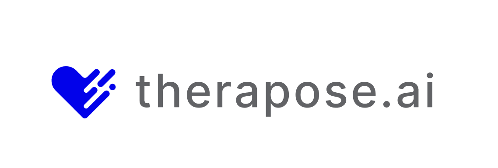
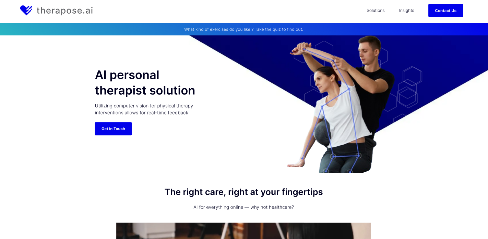

<!-- Improved compatibility of back to top link: See: https://github.com/othneildrew/Best-README-Template/pull/73 -->
<a name="readme-top"></a>
<!--
*** Thanks for checking out the Best-README-Template. If you have a suggestion
*** that would make this better, please fork the repo and create a pull request
*** or simply open an issue with the tag "enhancement".
*** Don't forget to give the project a star!
*** Thanks again! Now go create something AMAZING! :D
-->


<!-- PROJECT SHIELDS -->
<!--
*** I'm using markdown "reference style" links for readability.
*** Reference links are enclosed in brackets [ ] instead of parentheses ( ).
*** See the bottom of this document for the declaration of the reference variables
*** for contributors-url, forks-url, etc. This is an optional, concise syntax you may use.
*** https://www.markdownguide.org/basic-syntax/#reference-style-links
-->
[![Contributors][contributors-shield]][contributors-url]
[![Forks][forks-shield]][forks-url]
[![Stargazers][stars-shield]][stars-url]
[![Issues][issues-shield]][issues-url]
[![MIT License][license-shield]][license-url]
[![LinkedIn][linkedin-shield]][linkedin-url]


<!-- PROJECT LOGO -->
<br />
<div align="center">
  <a href="https://github.com/othneildrew/Best-README-Template">
    
  </a>

  <h3 align="center">TheraPose.ai</h3>

  <p align="center">
    First AI personal therapist solution !
    <br />
    <a href="https://github.com/othneildrew/Best-README-Template"><strong>Explore the docs »</strong></a>
    <br />
    <br />
    <a href="https://github.com/othneildrew/Best-README-Template">View Demo</a>
    ·
    <a href="https://github.com/othneildrew/Best-README-Template/issues/new?labels=bug&template=bug-report---.md">Report Bug</a>
    ·
    <a href="https://github.com/othneildrew/Best-README-Template/issues/new?labels=enhancement&template=feature-request---.md">Request Feature</a>
  </p>
</div>


<!-- TABLE OF CONTENTS -->
<details>
  <summary>Table of Contents</summary>
  <ol>
    <li>
      <a href="#about-the-project">About The Project</a>
      <ul>
        <li><a href="#built-with">Built With</a></li>
      </ul>
    </li>
    <li>
      <a href="#getting-started">Getting Started</a>
      <ul>
        <li><a href="#prerequisites">Prerequisites</a></li>
        <li><a href="#installation">Installation</a></li>
      </ul>
    </li>
    <li><a href="#usage">Usage</a></li>
    <li><a href="#roadmap">Roadmap</a></li>
    <li><a href="#contributing">Contributing</a></li>
    <li><a href="#license">License</a></li>
    <li><a href="#contact">Contact</a></li>
    <li><a href="#acknowledgments">Acknowledgments</a></li>
  </ol>
</details>


<!-- ABOUT THE PROJECT -->
## About The Project



In a landscape of healthcare and rehabilitation apps, TheraPose.ai emerges as a game-changer. Designed specifically for individuals undergoing physical therapy, TheraPose.ai utilizes cutting-edge computer vision technology to provide invaluable support during their recovery journey.

Here's why TheraPose.ai is a standout solution:

* Personalized rehabilitation: TheraPose.ai empowers patients to take control of their rehabilitation process by offering real-time feedback on their exercise performance. By accurately assessing their movements, the app ensures that patients are executing prescribed exercises correctly, minimizing the risk of further injury and maximizing therapeutic benefits.
* Streamlined guidance: Say goodbye to uncertainty and guesswork. TheraPose.ai streamlines the rehabilitation process by offering clear, visual cues and corrections, guiding patients through each exercise with precision and clarity.
* Empowering patients: With TheraPose.ai, patients can track their progress over time, witnessing tangible improvements in their mobility and strength. This visual representation of progress serves as a powerful motivator, encouraging patients to stay dedicated to their therapy regimen.
While TheraPose.ai may not cater to every individual's specific therapy needs, it serves as a comprehensive and reliable tool for patients seeking to optimize their rehabilitation experience. We're committed to continually enhancing the app's features and functionalities and welcome contributions and feedback from the community. Together, we can make TheraPose.ai the ultimate companion for patients on their path to recovery.

<p align="right">(<a href="#readme-top">back to top</a>)</p>

### Persona
#### Name: Anh Tuan
#### Characteristics:
Age: 45
Health Status: Undergoing physical therapy treatment following a traffic accident.
Location: Hanoi, Vietnam
####  Needs and Goals:
Anh Tuan is a patient undergoing physical therapy treatment who often needs to perform exercises and movements as instructed by doctors or physical therapists.
He requires an app to remotely submit physical therapy exercises, through which he can receive feedback and guidance from healthcare professionals conveniently and effectively.
#### Habits and Preferences:
Anh Tuan often feels tired and has difficulty moving due to injuries from the traffic accident, so he needs an easy-to-use remote app that doesn't require him to travel to the hospital or physical therapy clinic.
He prefers an interface that is user-friendly and visually intuitive, helping him easily perform physical therapy exercises and submit results to healthcare professionals.
#### Challenges and Issues:
Anh Tuan struggles to perform physical therapy exercises correctly and adequately each day.
He feels lonely and helpless without frequent support and guidance from healthcare professionals.

### Built With

This section should list any major frameworks/libraries used to bootstrap your project. Leave any add-ons/plugins for the acknowledgements section. Here are a few examples.

* [![Next][Next.js]][Next-url]
* [![React][React.js]][React-url]
* [![React][React Native]][React-native-url]
* [![Java Spring][Java]][Java-Spring-url]
* [![PyTorch][PyTorch-badge]][PyTorch-url]
* [![Jupyter Notebook][Jupyter-badge]][Jupyter-url]
* [![Python][Python-badge]][Python-url]
* [![Docker][Docker-badge]][Docker-url]
* [![PostgreSQL][PostgreSQL-badge]][PostgreSQL-url]


<p align="right">(<a href="#readme-top">back to top</a>)</p>


<!-- GETTING STARTED -->
## Getting Started

This is an example of how you may give instructions on setting up your project locally.
To get a local copy up and running follow these simple example steps.

### Prerequisites

This is an example of how to list things you need to use the software and how to install them.
* npm
  ```sh
  npm install npm@latest -g
  ```

### Installation

_Below is an example of how you can instruct your audience on installing and setting up your app. This template doesn't rely on any external dependencies or services._

1. Get a free API Key at [https://example.com](https://example.com)
2. Clone the repo
   ```sh
   git clone https://github.com/your_username_/Project-Name.git
   ```
3. Install NPM packages
   ```sh
   npm install
   ```
4. Enter your API in `config.js`
   ```js
   const API_KEY = 'ENTER YOUR API';
   ```

<p align="right">(<a href="#readme-top">back to top</a>)</p>


<!-- USAGE EXAMPLES -->
## Usage

Use this space to show useful examples of how a project can be used. Additional screenshots, code examples and demos work well in this space. You may also link to more resources.

_For more examples, please refer to the [Documentation](https://example.com)_

<p align="right">(<a href="#readme-top">back to top</a>)</p>


<!-- ROADMAP -->
## Roadmap

- [x] Add Changelog
- [x] Add back to top links
- [ ] Add Additional Templates w/ Examples
- [ ] Add "components" document to easily copy & paste sections of the readme
- [ ] Multi-language Support
    - [ ] Chinese
    - [ ] Spanish

See the [open issues](https://github.com/othneildrew/Best-README-Template/issues) for a full list of proposed features (and known issues).

<p align="right">(<a href="#readme-top">back to top</a>)</p>


<!-- CONTRIBUTING -->
## Contributing

Contributions are what make the open source community such an amazing place to learn, inspire, and create. Any contributions you make are **greatly appreciated**.

If you have a suggestion that would make this better, please fork the repo and create a pull request. You can also simply open an issue with the tag "enhancement".
Don't forget to give the project a star! Thanks again!

1. Fork the Project
2. Create your Feature Branch (`git checkout -b feature/AmazingFeature`)
3. Commit your Changes (`git commit -m 'Add some AmazingFeature'`)
4. Push to the Branch (`git push origin feature/AmazingFeature`)
5. Open a Pull Request

<p align="right">(<a href="#readme-top">back to top</a>)</p>


<!-- LICENSE -->
## License

Distributed under the MIT License. See `LICENSE.txt` for more information.

<p align="right">(<a href="#readme-top">back to top</a>)</p>


<!-- CONTACT -->
## Contact

Nguyen Quy Dang - [@your_twitter](https://twitter.com/dangnq2501) - dangnq2501@gmail.com

Project Link: [https://github.com/your_username/repo_name](https://github.com/dangnq2501/TheraPose.ai)

<p align="right">(<a href="#readme-top">back to top</a>)</p>


<!-- ACKNOWLEDGMENTS -->
## Acknowledgments

Use this space to list resources you find helpful and would like to give credit to. I've included a few of my favorites to kick things off!

* [Choose an Open Source License](https://choosealicense.com)
* [GitHub Emoji Cheat Sheet](https://www.webpagefx.com/tools/emoji-cheat-sheet)
* [Malven's Flexbox Cheatsheet](https://flexbox.malven.co/)
* [Malven's Grid Cheatsheet](https://grid.malven.co/)
* [Img Shields](https://shields.io)
* [GitHub Pages](https://pages.github.com)
* [Font Awesome](https://fontawesome.com)
* [React Icons](https://react-icons.github.io/react-icons/search)

<p align="right">(<a href="#readme-top">back to top</a>)</p>


<!-- MARKDOWN LINKS & IMAGES -->
<!-- https://www.markdownguide.org/basic-syntax/#reference-style-links -->
[contributors-shield]: https://img.shields.io/github/contributors/dangnq2501/TheraPose.ai.svg?style=for-the-badge
[contributors-url]: https://github.com/othneildrew/Best-README-Template/graphs/contributors](https://github.com/dangnq2501/TheraPose.ai/graphs/contributors
[forks-shield]: https://img.shields.io/github/forks/dangnq2501/TheraPose.ai.svg?style=for-the-badge
[forks-url]: https://github.com/dangnq2501/TheraPose.ai/network/members
[stars-shield]: https://img.shields.io/github/stars/dangnq2501/TheraPose.ai.svg?style=for-the-badge
[stars-url]: https://github.com/dangnq2501/TheraPose.ai/stargazers 
[issues-shield]: https://img.shields.io/github/issues/dangnq2501/TheraPose.ai.svg?style=for-the-badge
[issues-url]: https://github.com/dangnq2501/TheraPose.ai/issues
[license-shield]: https://img.shields.io/github/license/dangnq2501/TheraPose.ai.svg?style=for-the-badge
[license-url]: https://github.com/dangnq2501/TheraPose.ai/blob/master/LICENSE.txt
[linkedin-shield]: https://img.shields.io/badge/-LinkedIn-black.svg?style=for-the-badge&logo=linkedin&colorB=555
[linkedin-url]: https://linkedin.com/in/nhatdo94
[product-screenshot]: images/screenshot.png
[Next.js]: https://img.shields.io/badge/next.js-000000?style=for-the-badge&logo=nextdotjs&logoColor=white
[Next-url]: https://nextjs.org/
[React.js]: https://img.shields.io/badge/React-20232A?style=for-the-badge&logo=react&logoColor=61DAFB
[React-url]: https://reactjs.org/
[Vue.js]: https://img.shields.io/badge/Vue.js-35495E?style=for-the-badge&logo=vuedotjs&logoColor=4FC08D
[Vue-url]: https://vuejs.org/
[Angular.io]: https://img.shields.io/badge/Angular-DD0031?style=for-the-badge&logo=angular&logoColor=white
[Angular-url]: https://angular.io/
[Svelte.dev]: https://img.shields.io/badge/Svelte-4A4A55?style=for-the-badge&logo=svelte&logoColor=FF3E00
[Svelte-url]: https://svelte.dev/
[Laravel.com]: https://img.shields.io/badge/Laravel-FF2D20?style=for-the-badge&logo=laravel&logoColor=white
[Laravel-url]: https://laravel.com
[Bootstrap.com]: https://img.shields.io/badge/Bootstrap-563D7C?style=for-the-badge&logo=bootstrap&logoColor=white
[Bootstrap-url]: https://getbootstrap.com
[JQuery.com]: https://img.shields.io/badge/jQuery-0769AD?style=for-the-badge&logo=jquery&logoColor=white
[JQuery-url]: https://jquery.com 
[React-native-url]: https://reactnative.dev/
[Java-Spring-url]: https://spring.io/
[Java]: https://img.shields.io/badge/Java_Spring-6DB33F?style=for-the-badge&logo=spring&logoColor=white
[React Native]: https://img.shields.io/badge/React_Native-61DAFB?style=for-the-badge&logo=react&logoColor=white
[PyTorch-badge]: https://img.shields.io/badge/PyTorch-EE4C2C?style=for-the-badge&logo=pytorch&logoColor=white
[PyTorch-url]: https://pytorch.org/
[Jupyter-badge]: https://img.shields.io/badge/Jupyter-Notebook-F37626?style=for-the-badge&logo=jupyter&logoColor=white
[Jupyter-url]: https://jupyter.org/
[Python-badge]: https://img.shields.io/badge/Python-3776AB?style=for-the-badge&logo=python&logoColor=white
[Python-url]: https://www.python.org/
[Docker-badge]: https://img.shields.io/badge/Docker-2496ED?style=for-the-badge&logo=docker&logoColor=white
[Docker-url]: https://www.docker.com/
[PostgreSQL-badge]: https://img.shields.io/badge/PostgreSQL-336791?style=for-the-badge&logo=postgresql&logoColor=white
[PostgreSQL-url]: https://www.postgresql.org/
